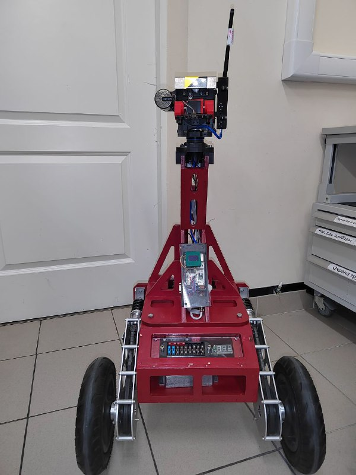

# Johnny
- ПО работы робота телеприсутствия Johnny
- Исходный репозиторий [СКТБ ЦНИИ РТК](https://github.com/RTC-SCTB/JohnnyMoscow)

Включение робота.

1. 
2. 
3. 
Выключение робота.

1. Нажать на черную кнопку, находящуюся на нижней грани бортового компьютера
2. На экране должна появиться надпись "OFF"
3. Через 10-15 секунд нажать на красную кнопку, находящуюся под бортовым компьютером, тем самым отключив робота от АКБ
4. Установить защитные колпачки на камеры робота
4. При длительном хранении или замене АКБ, разъеденить разъем АКБ

Пульт. Тестировалось на ОС Ubuntu 16.04 LTS

1. Репозиторий проекта https://github.com/RTC-SCTB/JohnnyMoscow
2. Клонировать репозиторий в папку
3. Убедиться, что пультовой компьютер находится в одной подсети с роботом
4. Подключить к пультовому компьютеру джойстик и шлем. При подключении шлема желательно сорентировать его в пространстве параллельно курсу шасси робота. На джойстике нажать клавишу "Analog", при этом на джойстике должен загореться красный светодиод.
5. В файле conf.json прописать IP адрес робота
6. Запустить пульт, набрав в терминале
	python3 onpult.py
7. В открывшемся окне нажать на кнопку включения
8. При этом голова робота должна начать калиброваться по всем осям. После завершения калибровки все оси головы должны занять среднее положение.
9. Окно со стереокартинкой с камер необходимо перенести на монитор шлема и развернуть его на весь экран.
10. Шлем одеть на голову оператора, настроить фокусное и межзрачковое расстояние покрутив соответствующие колесики на шлеме
11. Для включения режима повторения поворотов головы необходимо нажать кнопку на шлеме находящуюся на его торце сверху. Выключение режима, повторное нажатие.
12. Движение шасси робота осуществляется нажатиями на кнопки джойстика с левой стороны. Остальные кнопки не задействованы.
14. Отключение пульта от робота осуществляется нажатием на кнопку включения.

АКБ

1. Зарядное устройство перевести в режим зарядки свинцовых АКБ
2. Ток заряда 2 ампера. Напряжение заряда 12В (6S)
3. Документация на батарею https://static.chipdip.ru/lib/549/DOC001549827.pdf
